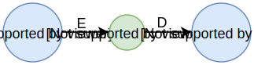
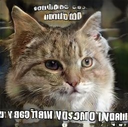

# Pulling out the big GANs

## From representation learning to faking things

Eduardo Pinho

 
<!-- 
DSPT
 -->

4th June 2019

    
    
    
    

---

## Table of Contents

 

1. Representation Learning
2. Generative Adversarial Networks
3. Use case: concept detection from medical images

---

## Deep Learning

<ul>
  <li>Achieving significant milestones over the last decade.</li>
  <li>Evolving quickly.</li>
  <li>Ever ubiquitous and attainable.</li>
  <ul>
    <li>Good literature is open-access (ArXiv)</li>
    <li>Open-source software (TensorFlow, Torch, ...)</li>
  </ul>
  <li class="fragment" data-fragment-index="0">Annotated data is often limited.</li>
  <li class="fragment" data-fragment-index="0">How to explore unlabeled data?</li>
<ul>

.

<b>Representation Learning</b>

Goodfellow et al. <em>"Deep Learning"</em>. 2016. <a href="https://www.deeplearningbook.org">www.deeplearningbook.org</a>

.

## Representation Learning

 - Also called **feature learning**.
 - Given a data set $X$, learn a function $$f(x) \rightarrow z$$ which maps samples to a new latent domain $Z$ that makes other problems easier to solve.
 - <!-- .element: class="fragment" data-fragment-index="0" --> <em>Feature extraction</em>?
 - Often posed as either deterministic or probabilistic. <!-- .element: class="fragment" data-fragment-index="1" -->
    - Original samples in distribution: $x$ | &nbsp; $p(x)$.
    - Representation: $z = f(x)$ &nbsp; | &nbsp; $p(z | x)$
    - Classification: $y = c(z)$ &nbsp; | &nbsp; $p(y | z)$

.

General priors of representation learning:

<ul>
<li>Smoothness ($a \approx b \implies f(a) \approx f(b)$)</li>
<li>Hierarchical organization</li>
<li>Sparsity</li>
<li>Semi-supervised learning</i>
<li>Temporal and spatial coherence</li>
<li>Multiple explanatory factors</li>
<li>Shared factors across tasks</li>
<li>Simplicity of factor dependencies</li>
<li>...</li>
<li>Manifolds</li>
</ul>

Bengio et al. <em>"Representation Learning: A review and new perspectives"</em>. 2013.

.

## What is a manifold?

> [[wikipedia](https://en.wikipedia.org/wiki/Manifold)] In mathematics, a **manifold** is a topological space that locally resembles Euclidean space near each point. More precisely, each point of an _n_-dimensional manifold has a neighbourhood that is homeomorphic to the Euclidean space of dimension n.
<!-- .element: style="font-size: 12pt" -->

 <!-- .element: class="fragment" data-fragment-index="0" -->

Notes: So what is a manifold? Well, it's the reason why mathematicians can't play poker. They usually end up with a bad hand and go "man I fold". except not.

.

The **manifold hypothesis**:

> [...] real-world data presented in high-dimensional spaces are expected to concentrate in the vicinity of a manifold $\mathcal{M}$ of much lower dimensionality $d_{\mathcal{M}}$, embedded in high-dimensional input space $\mathbb{R}^{d_x}$.

ImageNet: over 64,000s pixels / image, but not $256^{3 \times 64,000}$ possible images

Notes: Think of it as a subspace of the original data domain, to which our data tends to concentrate to. Considering the domain of natural images for a moment: if they are resized to 256x256, we have over 64 thousand RGB pixels / image, which makes an absurdly huge dimensionality. However, we know that we won't find every possible RGB image combination in ImageNet. It will be incredibly more specific. Hence, these images will sit in this manifold, and they can be mapped into a domain of lower dimensionality that can yet retain all the information from the previous domain of the data.

.

<h3>Manifold learning</h3>
$$X \rightarrow \mathcal{M}$$

<ul>
<li>Dimensionality reduction</li>
<li>Concentration points: categories</li>
<li>Linear separability</li>
<li>Noise detection</li>
</ul>

.

### Early Representation Learning:   Principal Component Analysis

- models a linear manifold
- $z = f(x) = \mathrm{W}^Tx + b$
- Decorrelated features in $z$ (principal components)

.

### Autoencoder

- Encoder-decoder with a bottleneck (AKA latent code)
- Minimize reconstruction loss: $D(E(x)) \approx x$
   - Often mean squared error: $|x - D(E(x))|^2_2$
- Constrained $z$
<li class="fragment" data-fragment-index="0"> Can be <em>overcomplete</em>!</li>
  <ul class="fragment" data-fragment-index="0">
  <li>Regularize the representation (e.g. induce sparsity)</li>
  </ul>

.

### Variational Autoencoder

<ul style="font-size: 20pt">
<li>Autoencoder with Kulback-Leibler divergence for variational inference</li>
<li>Generative model: can sample images from the latent space</li>
</ul>

Kingma et al. <em>"Auto-Encoding Variational Bayes"</em>. 2014

.

#### VAE Sampling (VAE)

.

### Honorable mentions:

- k-means clustering
   - plus other clustering algorithms
- Sparse Coding
- Boltzmann Machines
   - Restricted Boltzmann Machines (RBMs)
   - Deep Belief Networks (DBNs)

---

# Generative Adversarial Networks

.

### GAN

A min-max game between a **Generator** and a **Discriminator**.

- $G$: given a prior $z$, create samples $q(x|z)$ close to $p(x)$
- $D$: distinguish real samples $p(x)$ from generated samples $q(x)$

$$\min_{G} \max_{D} V(D, G) = \mathbb{E}_{x \sim p(x)} \big(\log (D(x))\big)$$ <!-- .element: class="fragment" data-fragment-index="0" -->

$$ + \mathbb{E}_{z \sim p(z)} \big(\log (1 - D(G(z))\big)$$ <!-- .element: class="fragment" data-fragment-index="0" -->

.

GANs do not memorize data

.

GANs can get weird...

.

GANs can do latent space arithmetic

Radford et al. <em>"Unsupervised Representation Learning with Deep Convolutional Generative Adversarial Networks"</em>. 2016

.

### Domain Transfer: Cycle GAN

2 generators + 2 discriminators + cycle-consistency

Zhu et al. <em>"Unpaired Image-to-Image Translation using Cycle-Consistent Adversarial Networks"</em>. 2017

.

.

### Domain Transfer: Pix2Pix

Isola et al. <em>"Image-to-Image Translation with Conditional Adversarial Nets"</em>. 2017

.

Wang et al. <em>"High-Resolution Image Synthesis and Semantic Manipulation with Conditional GANs"</em>. 2018
.

### Domain Transfer: Star GAN

- Multiple discriminators, *one* generator

Choi et al. <em>"StarGAN: Unified Generative Adversarial Networks for Multi-Domain Image-to-Image Translation"</em>. 2017

.

#### Super-resolution

Ledig et al. <em>"Photo-Realistic Single Image Super-Resolution Using a Generative Adversarial Network"</em>. 2017

.

## Big GAN

Large GAN for natural images.

- Improved fidelity / variety

Brock et al. <em>"Large Scale GAN Training for High Fidelity Natural Image Synthesis"</em>. 2018

.

<blockquote class="twitter-tweet" data-lang="en">
<a href="https://twitter.com/hashtag/BigGAN?src=hash&amp;ref_src=twsrc%5Etfw">#BigGAN</a> is so much fun. I stumbled upon a (circular) direction in latent space that makes party parrots, as well as other party animals: <a href="https://t.co/zU1mCh9UBe">pic.twitter.com/zU1mCh9UBe</a>
&mdash; Phillip Isola (@phillip_isola) <a href="https://twitter.com/phillip_isola/status/1066567846711476224?ref_src=twsrc%5Etfw">November 25, 2018</a></blockquote>

.

Original source of dogball

.

## Self Attention GAN (SAGAN)

- Integrate self attention modules
- Faithful replication of local content from global context

Zhang et al.<em>"Self attention Generative Adversarial Networks"</em>. 2018

.

## Progressive GAN

- Progressively grow the generator and discriminator.
   - 4x4, 8x8, ..., **1024x1024**

Karras et al. <em>"Progressive Growing of GANs for Improved Quality, Stability, and Variation"</em>. 2018

.

### Progressive GAN: CelebA interpolation

<iframe src="https://drive.google.com/file/d/1gl6FSeTqqWqqg-JXjWBxA0f-MGaq9BlL/preview" width="640" height="480"></iframe>

.

### Unsupervised disentanglement: InfoGAN

- Add categorical prior, approximate mutual information between categories.

Chen et al. <em>"InfoGAN: Interpretable Representation Learning by Information Maximizing Generative Adversarial Nets"</em>. 2016

.

## StyleGAN

- NVIDIA's next step
- Unsupervised learning of style (coarse + fine)

<!-- TODO insert image or something of the like -->

Karras et al. "A Style-Based Generator Architecture for Generative Adversarial Networks". 2018

.

### [www.ThisPersonDoesNotExist.com](https://www.thispersondoesnotexist.com)

<iframe width="960" height="600" src="https://www.thispersondoesnotexist.com"></iframe>

.

### Realistic Talking Head Models

Zakharov et al. <em>"Few-Shot Adversarial Learning of Realistic Neural Talking Head Models"</em>. 2019

.

### Shortcomings

Easy to shoot your foot with:

- Hard to train ─ balancing discriminator and generator
- Mode collapse
- Class switching

.

### Attempts of improving the training process

- Feature Matching; Minibatch Discrimination; Batch Renormalization
   - Salimans et al. 2016
- Wasserstein GAN (Arjovsky et al. 2017)
- Gradient Penalization (Gulrajani et al. 2017)
- Instance noise (Sønderby et al. 2017) 
- Spectral Normalization (Miyamoto et al. 2018)
- Relativistic GAN loss (Jolicoeur-Martineau. 2018)

.

#### <a href="https://ajolicoeur.wordpress.com/relativisticgan/">Relativistic GAN</a>

Jolicoeur-Martineau. <em>"The relativistic discriminator: a key element missing from standard GAN"</em>. 2019

---

## Use case: concept detection from medical images

.

- Medical imaging data sets, very few to no annotations.
   - Expertise is usually required

- Automated labelling contributes to an enriched image database.

.

ImageCLEF Caption 2017 / 2018 / 2019

- Pubmed Central (PMC): images from biomedical literature.
- Annotations: lists of CUI identifiers extracted from captions.

<h4>ImageCLEF Caption 2018</h4>
<ul>
<li>No subfigures, pre-filtering</li>
<li>Training: 223,859 images</li>
<li>Testing: 9,938 images</li>
<li>Over 100 thousand unique concepts</li>
<ul>

.

### Method Outline

<!--
.

#### Bags of Visual Words

<ul style="font-size: 20pt">
<li>Extract visual keypoints:</li>
<ul>
<li>Scale Invariant Feature Transform (SIFT) - Lowe et al. 2004</li>
<li>Oriented FAST and Rotated BRIEF (ORB) - Rublee et al. 2011</li>
</ul>
<li>Construct visual vocabulary (k-means clustering)</li>
<li>Quantify keypoints into "bags"</li>
</ul>

-->

.

#### Adversarial Autoencoder

<ul style="font-size: 20pt">
<li>Autoencoder with adversarial loss for regularization</li>
<li>$D$ forces $E$ to approximate a prior distribution</li>
<li>Features extracted from the bottleneck vector</li>
</ul>

Makhzani et al. <em>"Adversarial Autoencoders"</em>. 2015

.

#### Flipped-Adversarial Autoencoder

<ul style="font-size: 20pt">
<li>A GAN with a latent regressor $E$</li>
<li>2-level for stability</li>
<li>Baseline, poor performance is expected</li>
<li>Features extracted with $E(x)$</li>
</ul>

.

### Qualitative check

.

#### F-AAE Interpolation

.

### Multi-label Classification

#### Logistic Regression

- Attempt to classify the 500 most frequent concepts.
- Loose threshold fine tuning to optimize F1 score.

.

### Multi-label Classification

#### k-Nearest Neighbors

- Index training set
- Similarity search over the given features (CBIR)
- Combine the concepts of the first $k$ search hits

.

### Results - ImageCLEF 2018

Official participation

|Rank | Run file name                                    | Kind  | Classifier   | **Test $F_1$** |
|-----|--------------------------------------------------|-------|--------------|----------------|
|**1**| <small>aae-500-o0-2018-04-30\_1217</small>       |  AAE  | linear(500)  | **0.1102**     |
|  2  | <small>aae-2500-merge-2018-04-30\_1812</small>   |  AAE  | linear(2500) | 0.1082         |
|  3  | <small>lin-orb-500-o0-2018-04-30\_1142</small>   |  ORB  | linear(500)  | 0.0978         |
|  9  | <small>faae-500-o0-2018-04-27\_1744</small>      | F-AAE | linear(500)  | 0.0825         |
| 11  | <small>knn-ip-aae-train-2018-04-27\_1259</small> |  AAE  | k-NN(cosine) | 0.0570         |
| 12  | <small>knn-aae-all-2018-04-26\_1233</small>      |  AAE  | k-NN($L^2$)  | 0.0559         |
| 19  | <small>knn-orb-all-2018-04-24\_1620</small>      |  ORB  | k-NN($L^2$)  | 0.0314         |
| 21  | <small>knn-ip-faae-all-2018-04-27\_1512</small>  | F-AAE | k-NN(cosine) | 0.0280         |
| 22  | <small>knn-faae-all-2018-04-26\_0933</small>     | F-AAE | k-NN($L^2$)  | 0.0272         |

.

#### Final Remarks

- Unsupervised learning methods are very promising.
   - Despite the tendency for end-to-end DNN classifiers

  

- Generative adversarial networks are still a hot topic.
- Many other feature learning methods.
- Explore non-visual information in representation learning.

Open-source  [github.com/bioinformatics-ua/imageclef-toolkit](https://github.com/bioinformatics-ua/imageclef-toolkit)

---

# Conclusion

### Deep Learning?

&nbsp;

.

→ Representation learning ←

.

<h3 style="margin-top: 4cm">Thank you!</h3>

   <a href="https://github.com/Enet4"> Enet4</a>
    
   <a href="https://www.twitter.com/E_net4">@E_net4</a>

Note: This concludes my presentation. You are probably extremely hungry by now, so thank you for your patience. We can talk more about these subjects during tonight's dinner, or find me some other time on Twitter or GitHub.
