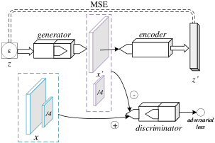

# Pulling out the big GANs

## From representation learning to faking things

Eduardo Pinho

 
<!-- 
DSPT
 -->

5th June 2019

    
    
    
    

---

## Table of Contents

 

1. Representation Learning
2. Generative Adversarial Networks
3. Use case: concept detection from medical images

---

### Deep learning

- Achieving significant milestones over the last decade.

.

Goodfellow et al. <em>"Deep Learning Book"</em>. 2016. <a href="https://www.deeplearningbook.org">www.deeplearningbook.org</a>

---

## Representation learning

- Also called **feature learning**.
- Given a data set $X$, learning a function $f(x) \rightarrow z$, mapping samples to a new domain $Z$ that makes other problems easier to solve.
- _Feature extraction_? <!-- .element: class="fragment" data-fragment-index="0" -->
- Often depicted with probabilistic methods. <!-- .element: class="fragment" data-fragment-index="1" -->
   - $x \sim p(x)$, $p(z | x)$
   - Classification: $p(y | x)$

.

General priors of representation learning (Bengio et al. 2013):

<ul>
<li>Smoothness</li>
  <ul>
  <li> $a \approx b => f(a) \approx f(b)$ 
  </ul>
<li>Hierarchical organization</li>
<li>Sparsity</li>
<li>Temporal and spatial coherence</li>
<li>Simplicity of factor dependencies</li>
<li>Manifold</li>
</ul>

Bengio et al. <em>"Representation Learning"</em>. 2013. <a href="https://www.deeplearningbook.org">www.deeplearningbook.org</a>

.

## What is a manifold?

 <!-- .element: class="fragment" data-fragment-index="0" -->

Notes: So what is a manifold? Well, it's the reason why mathematicians can't play poker. They usually end up with a bad hand and go "man I fold". except not.

.

<!-- TODO  -->

Notes: Think of it as a subspace of the original data domain.

### Deep learning

.

---

# Generative Adversarial Networks

## BigGAN

Large GAN for natural images.

- Original source of dog tennis ball

.

## Progressive GAN

- Progressively grow the generator and discriminator.
   - 4x4, 8x8, ..., **1024x1024**

<!-- TODO insert GIF -->

.

## StyleGAN

- NVIDIA's next step
- Unsupervised learning of style (coarse + fine)

<!-- TODO insert image or something of the like -->

.

### [www.ThisPersonDoesNotExist.com](https://www.thispersondoesnotexist.com)

<iframe width="800" height="600" src="https://www.thispersondoesnotexist.com"></iframe>

---

## Use case: concept detection from medical images

.

- Medical imaging data sets, very few to no annotations.
   - Expertise is usually required

.

ImageCLEF Caption 2017 + 2018 + 2019

- Pubmed Central (PMC): images from biomedical literature.
- Annotations: lists of CUI identifiers extracted from captions.

<h3>2017</h3>
<ul>
<li>Challenge's pilot year</li>
<li>Training: 164,614 images</li>
<li>Validation: 10,000 images</li>
<li>Testing: 10,000 images</li>
<ul>

<h3>2018</h3>
<ul>
<li>No subfigures, pre-filtering</li>
<li>Training: 223,859 images</li>
<li>Testing: 9,938 images</li>
<li>Over 100 thousand unique concepts</li>
<ul>

.

### Method Outline

.

#### Bags of Visual Words

<ul style="font-size: 20pt">
<li>Extract visual keypoints:</li>
<ul>
<li>Scale Invariant Feature Transform (SIFT) - Lowe et al. 2004</li>
<li>Oriented FAST and Rotated BRIEF (ORB) - Rublee et al. 2011</li>
</ul>
<li>Construct visual vocabulary (k-means clustering)</li>
<li>Quantify keypoints into "bags"</li>
</ul>

.

#### Sparse Denoising Auto-Encoder

<ul style="font-size: 20pt">
<li>Auto-encoder with sparsity-inducing regularization</li>
<ul>
<li>Vincent et al. 2010</li>
</ul>
<li>Added Gaussian noise $\tilde{x}$</li>
<li>Features extracted from the bottleneck vector</li>
</ul>

.

#### Variational Auto-Encoder

<ul style="font-size: 20pt">
<li>Auto-encoder with Kulback-Leibler divergence for variational inference</li>
<ul><li>Kingma et al. 2014</li></ul>
<li>Features extracted from the bottleneck vector</li>
</ul>

.

#### Bidirectional Generative Adversarial Network

<ul style="font-size: 20pt">
<li>Generative adversarial network (GAN) with an encoder</li>
<ul><li>Donahue et al. 2016</li></ul>
</ul>

$$V(G, E, D) = \min_{G, E} \max_{D} \mathbb{E}_{\mathrm{x} \sim p_{\mathrm{x}}} [\log{D(\mathrm{x}, E(\mathrm{x}))}] + \mathbb{E}_{\mathrm{z} \sim p_\mathrm{z}} [\log{(1 - D(G(\mathrm{z}), \mathrm{z}))}]$$

<ul style="font-size: 20pt">
<li>Features extracted with $E(x)$</li>
</ul>

.

#### Adversarial Auto-Encoder

<ul style="font-size: 20pt">
<li>Auto-encoder with adversarial loss for regularization</li>
<ul><li>Makhzani et al. 2015</li></ul>
<li>$D$ forces $E$ to approximate a prior distribution $\mathcal{N}(0, I)$</li>
<li>Features extracted from the bottleneck vector</li>
</ul>

.

#### Flipped-Adversarial Auto-Encoder

<ul style="font-size: 20pt">
<li>A GAN with a latent regressor $E$</li>
<ul><li>Zhang et al. 2018</li></ul>
<!-- TODO description <li> TODO description </li> -->
<li>2-level for stability</li>
<li>Baseline, poor performance is expected</li>
<li>Features extracted with $E(x)$</li>
</ul>

.

### Multi-label Classification

#### Logistic Regression

- Attempt to classify the $n$ most frequent concepts.
   - _750_ in ImageCLEF 2017, _500_ in ImageCLEF 2018
- Loose threshold fine tuning to optimize F1 score.

.

### Multi-label Classification

#### k-Nearest Neighbors

- Index training set
- Similarity search over the given features (CBIR)
- Combine the concepts of the first $k$ search hits

.

### Results - ImageCLEF 2018

Official participation

|Rank | Run file name                                    | Kind  | Classifier   | **Test $F_1$** |
|-----|--------------------------------------------------|-------|--------------|----------------|
|**1**| <small>aae-500-o0-2018-04-30\_1217</small>       |  AAE  | linear(500)  | **0.1102**     |
|  2  | <small>aae-2500-merge-2018-04-30\_1812</small>   |  AAE  | linear(2500) | 0.1082         |
|  3  | <small>lin-orb-500-o0-2018-04-30\_1142</small>   |  ORB  | linear(500)  | 0.0978         |
|  9  | <small>faae-500-o0-2018-04-27\_1744</small>      | F-AAE | linear(500)  | 0.0825         |
| 11  | <small>knn-ip-aae-train-2018-04-27\_1259</small> |  AAE  | k-NN(cosine) | 0.0570         |
| 12  | <small>knn-aae-all-2018-04-26\_1233</small>      |  AAE  | k-NN($L^2$)  | 0.0559         |
| 19  | <small>knn-orb-all-2018-04-24\_1620</small>      |  ORB  | k-NN($L^2$)  | 0.0314         |
| 21  | <small>knn-ip-faae-all-2018-04-27\_1512</small>  | F-AAE | k-NN(cosine) | 0.0280         |
| 22  | <small>knn-faae-all-2018-04-26\_0933</small>     | F-AAE | k-NN($L^2$)  | 0.0272         |

.

#### Final Remarks

- Unsupervised learning methods are very promising.
- Representations can be applied in CBIR.

  

- Generative adversarial networks are still a hot topic. <!-- .element: class="fragment" data-fragment-index="0" -->
- Many other feature learning methods. <!-- .element: class="fragment" data-fragment-index="0" -->
- Explore non-visual information in representation learning. <!-- .element: class="fragment" data-fragment-index="0" -->

Open-source: [github.com/bioinformatics-ua/imageclef-toolkit](https://github.com/bioinformatics-ua/imageclef-toolkit)

---

# Conclusion

.

## Summary

<!-- TODO check if these three are OK -->

1. Multimodal search engine for extensible PACS archives
2. Automated labelling for content discovery in medical imaging repositoriess
3. Modern feature learning methods for medical image concept understanding

Systems today are very likely to shift to these paradigms. <!-- .element: class="arrow-bullet fragment" data-fragment-index="0" -->

- Content-based queries → meaningful results <!-- .element: class="arrow-bullet fragment" data-fragment-index="0" -->
- Enhanced computer systems → assist medical staff <!-- .element: class="arrow-bullet fragment" data-fragment-index="0" -->

---

### Thank you.

Note: This concludes my presentation.